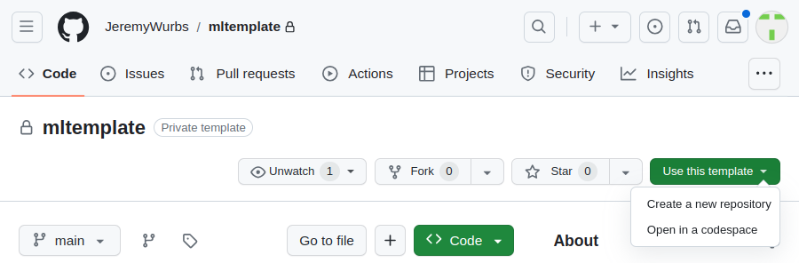
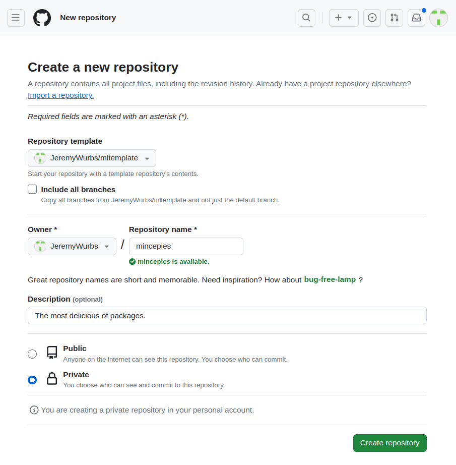
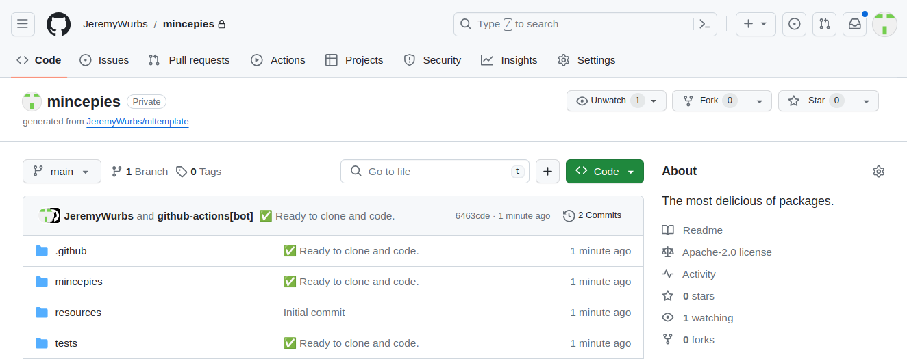

# Mltemplate
An end-to-end starter template for machine learning projects.

# How to use

Click the green `Use this template` button on the top right of this page to create a new repository from this template.
Name the new repository and give it a description, then click `Create repository` (works for both public and private
repos).  

Wait for the repository to be created and the first workflow to run, which will rename and update the project. Once 
done, refresh the page and follow the instructions to install your new project!

# What you get

This template provides a standardized, end-to-end project structure for machine learning projects. It is designed to be
modular, so if you don't need a particular component, you can simply delete it. The template includes:

- Training pipeline: 
- - [x] [Hydra](https://hydra.cc/) for configuration management
- - [x] [Pytorch Lightning](https://www.pytorchlightning.ai/) for training
- - [x] [MLflow](https://mlflow.org/) for experiment tracking
- - [x] [Tensorboard](https://www.tensorflow.org/tensorboard) for training visualization
- - [x] Example `nn.Module` MLP/CNN models with `pl.LightningModule` wrappers
- - [x] Example `pl.LightningDataModule` MNIST dataset
- - [x] Example end-to-end training script

- Model registry and deployment
- - [x] [MLflow](https://mlflow.org/) for model registry
- - [x] [FastAPI](https://fastapi.tiangolo.com/) for model deployment backend
- - [x] [Discord](https://discord.com/) for model deployment front-end
- - [x] [Docker](https://www.docker.com/) for containerization

- Project Management
- - [x] [Rye](https://github.com/mitsuhiko/rye) integration for end-to-end environment management
- - [x] [Github Actions](https://github.com/JeremyWurbs/mltemplate/actions) CI/CD workflows
- - [x] [pylint](https://www.pylint.org/), [isort](https://pycqa.github.io/isort/) and [black](https://black.readthedocs.io/en/stable/) for code formatting and linting
- - [x] [pytest](https://docs.pytest.org/en/6.2.x/) for unit testing
