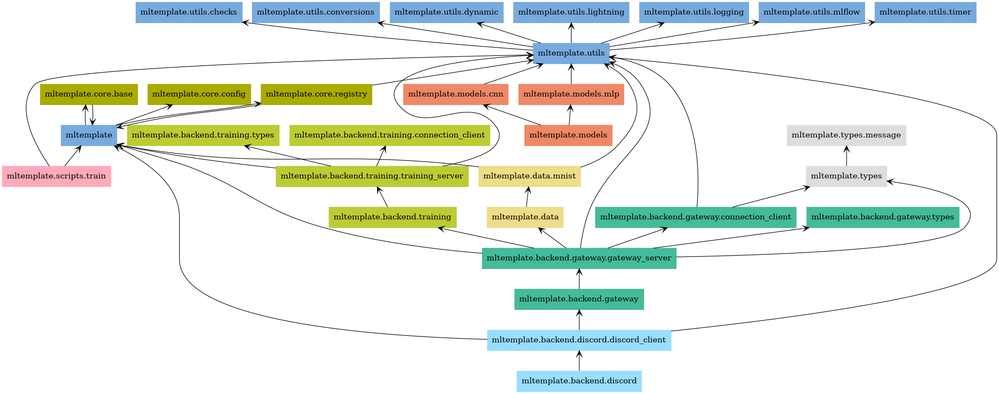
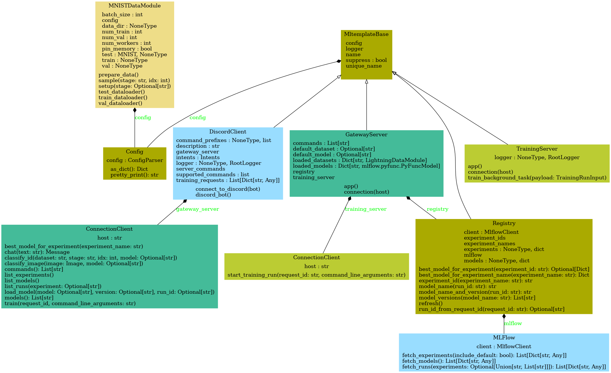

# Mltemplate
An end-to-end starter template for machine learning projects.

# Installation

```commandline
$ git clone git@github.com:JeremyWurbs/mltemplate.git && cd mltemplate
```

You may use standard python tools (pip) as desired, but it is recommended to use 
[Rye](https://github.com/mitsuhiko/rye), in which case all you need to do is:

```commandline
$ rye sync
```

# Usage

Run the demo with:

```commandline
$ rye run demo
```

This will train a simple MLP model on the MNIST dataset, tracking the training run through MLflow and exposing training 
logs to Tensorboard. The model will be saved to the (MLFlow) model registry when training finishes, which can be 
subsequently deployed through the FastAPI backend.

For running the end-to-end demo (which requires a 10-minute discord server setup), refer to the 
[end-to-end demo](#End-to-End-Demo) section below.

# Package Management

Rye will handle your virtual environment and dependencies for you. There are a number of useful commands available, 
which you can use through `rye run <command>`.

## Linting

To lint your code with [pylint](https://www.pylint.org/), [isort](https://pycqa.github.io/isort/) and 
[black](https://github.com/psf/black):

```commandline
$ rye run lint
```

```text 
pylint mltemplate/

------------------------------------
Your code has been rated at 10.00/10

pylint --disable=protected-access tests/

-------------------------------------------------------------------
Your code has been rated at 10.00/10


isort -l 120 --check mltemplate/

isort -l 120 --check tests/

black -l 120 --check mltemplate/
All done! ✨ 🍰 ✨
43 files would be left unchanged.

black -l 120 --check tests/
All done! ✨ 🍰 ✨
14 files would be left unchanged.
```

## Unit Tests

To run unit tests with [pytest](https://docs.pytest.org/en/):

```commandline
$ rye run test
```

```text 
============================= test session starts ==============================
platform linux -- Python 3.11.6, pytest-7.4.4, pluggy-1.3.0
rootdir: ~/mltemplate
plugins: cov-4.1.0, anyio-4.2.0, hydra-core-1.3.2
collected 13 items                                                             

tests/mltemplate/core/test_config.py ...                                 [ 23%]
...
tests/mltemplate/utils/test_timer_collection.py .                        [100%]

---------- coverage: platform linux, python 3.11.6-final-0 -----------
Name                                               Stmts   Miss  Cover   Missing
--------------------------------------------------------------------------------
mltemplate/__init__.py                                 3      0   100%
...
mltemplate/utils/timer_collection.py                  28      0   100%
--------------------------------------------------------------------------------
TOTAL                                               1134    854    25%


=========================== short test summary info ============================
SKIPPED [1] tests/mltemplate/core/test_registry.py:12: No runs found in MLflow.
======================== 12 passed, 1 skipped in 7.31s =========================


```

## Auto-formatting

To auto-format your code with [isort](https://pycqa.github.io/isort/) and [black](https://github.com/psf/black):

```commandline
$ rye run format 
```

```text
isort -l 120 mltemplate/

black -l 120 mltemplate/
All done! ✨ 🍰 ✨
43 files left unchanged.

isort -l 120 tests/

black -l 120 tests/
All done! ✨ 🍰 ✨
14 files left unchanged.
```

## Building the Docs

Build the docs using [sphinx](https://www.sphinx-doc.org/en/master/):

```commandline
$ rye run docs
```

Both HTML and PDF docs will be built, located in `docs/_build/html` and `docs/_build/simplepdf` respectively.

## Dependency Graph

To generate a dependency graph of the project, use pylint and [graphviz](https://graphviz.org/). Make sure graphviz is 
installed:

```commandline 
apt-get install graphviz
```

And then run:

```commandline
rye run graph-dependencies
```

Which should generate two files in the root directory: 

*packages.png*:


and *classes.png*:


You may use these graphs to help get a quick overview of the project, delete superfluous code and avoid circular 
dependencies.

## Building the Package

```commandline
rye build
```

```text
building mltemplate
* Creating virtualenv isolated environment...
* Installing packages in isolated environment... (hatchling)
* Getting build dependencies for sdist...
* Building sdist...
* Building wheel from sdist
* Creating virtualenv isolated environment...
* Installing packages in isolated environment... (hatchling)
* Getting build dependencies for wheel...
* Building wheel...
Successfully built mltemplate-0.1.0.tar.gz and mltemplate-0.1.0-py3-none-any.whl
```

## Continuous Integration

You have a starter CI workflow in [.github/workflows/ci.yml](.github/workflows/ci.yml) that will lint and test your 
project on Linux/MacOS/Windows. By default they will run with every push / pull request and can be accessed directly 
from [GithubActions](https://github.com/JeremyWurbs/mltemplate/actions). 

# End-to-End Demo

TODO: Add a demo of the discord bot here.
