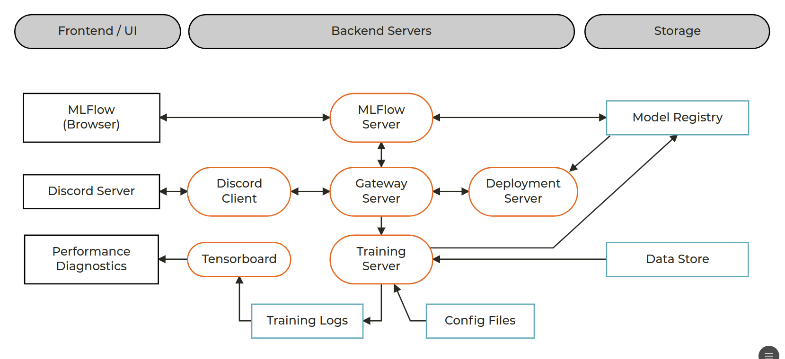
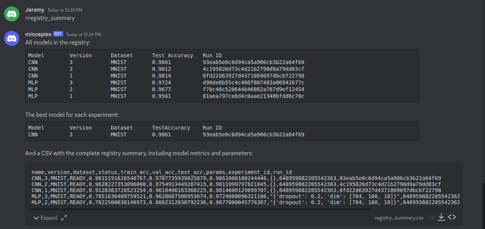
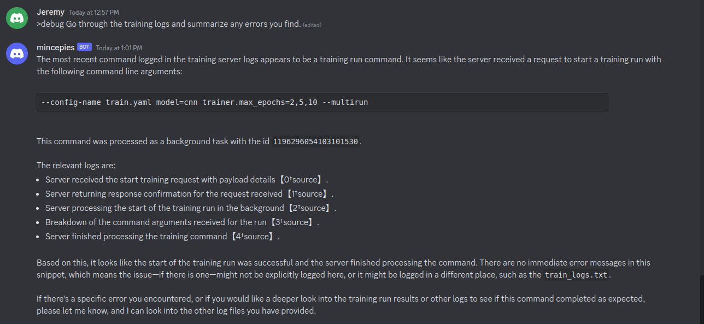

# Mltemplate


An end-to-end starter template for machine learning projects.

# Installation

```commandline
$ git clone git@github.com:JeremyWurbs/mltemplate.git && cd mltemplate
```

You may use standard python tools (pip) as desired, but it is recommended to use 
[Rye](https://github.com/mitsuhiko/rye), in which case all you need to do is:

```commandline
$ rye sync
```

To run the end-to-end demo application, refer to the [Demo](#Demo) section below. 

# Package Structure

The mltemplate package is an end-to-end machine learning framework for training and deploying models. It is meant for
to help kickstart new projects, containing all the structural components necessary to train, manage and deploy models. 
It is expected that you will need to adapt the package to your specific needs, but the provided package structure should 
be a good starting point. It is modular, so if you don't need a particular component, you can simply delete it.

At a high level, the mltemplate package covers the following components of the ML lifecycle:

- **Training framework**, built on top of PyTorch Lightning, including data, model, and configuration management;
- **Lifecycle management**, built on top of MLFlow, including experiment tracking, model versioning, and model serving;
- **Packaging**, including both python (`pip install mltemplate`) and docker (`docker compose up`) functionality; 
- **Model serving**, built on top of FastAPI, including a REST API for model access through a discord client
- **Quality of life tools**, including unit tests, automated documentation, and linting.

The Mltemplate package has been tested on Ubuntu 22.04 with Python 3.10.12.

## Package Components

The mltemplate package is organized into the following components:

- **[docs](docs)**. Contains the build files for sphinx documentation. Refer to the [Documentation](#Documentation) 
    section for more details;
- **[docker](docker)**. Contains Dockerfiles for building the mltemplate docker image. Refer to the [Docker](./docker) 
    module for more details;
- **[mltemplate](mltemplate)**: The main package, containing all the core functionality of the project;
  - **[mltemplate/backend](mltemplate/backend)**: Contains modules for running each of the discord, gateway and 
      training servers;;
  - **[mltemplate/configs](mltemplate/configs)**: Contains the (hydra) yaml files for model training;
  - **[mltemplate/core](mltemplate/core)**: Contains core mltemplate packages, including:
    - **[Config](mltemplate/core/config.py)**. This class provides access to the associated 
      [config.ini](mltemplate/core/config.ini) file, used for package-level configurations;
    - **[MltemplateBase](mltemplate/core/base.py)**. This class serves as a helper base class. It provides unified 
      logging functionality, among other features.
  - **[mltemplate/data](mltemplate/data)**. Contains modules for individual `pl.LightningDataModule` datasets;
  - **[mltemplate/models](mltemplate/models)**. Contains modules for individual `torch.nn.Module` models; also includes 
      a torch Lightning wrapper class for `torch.nn.Modules`, which can be used to wrap models during training;
  - **[mltemplate/modules](mltemplate/modules)**: Modules used within the package, including model Registry and GPT 
      classes;
  - **[mltemplate/utils](mltemplate/utils)**: Utility functions used throughout the package. Notable utilities include:
    - **[conversions](mltemplate/utils/conversions.py)**. Provides methods for converting and serializing PIL images, 
      used to pass images between servers;
    - **[logging](mltemplate/utils/logging.py)**. Provides a `default_logger` method, may be used to customize the 
      logger provided by the BaseMltemplate class;
  - **[mltemplate/scripts](mltemplate/scripts)**: Standalone scripts built on top of the mltemplate package; the project 
      starts with a training script that demonstrates how to set up a training pipeline to store models to the model 
      registry;
- **[tests](tests)**: Contains unit tests for the mltemplate package. Refer to the [Unit Tests](#Unit-Tests) section for 
    more details;

# Package Management

It is highly recommended to use [Rye](https://github.com/mitsuhiko/rye) as your package manager. In addition to handling 
your virtual environment and dependencies for you, there are additionally a number of useful commands available, which 
you can use through `rye run <command>`.

## Linting

To lint your code with [pylint](https://www.pylint.org/), [isort](https://pycqa.github.io/isort/) and 
[black](https://github.com/psf/black):

```commandline
$ rye run lint
```

```text 
pylint mltemplate/

------------------------------------
Your code has been rated at 10.00/10

pylint --disable=protected-access tests/

-------------------------------------------------------------------
Your code has been rated at 10.00/10


isort -l 120 --check mltemplate/

isort -l 120 --check tests/

black -l 120 --check mltemplate/
All done! ✨ 🍰 ✨
43 files would be left unchanged.

black -l 120 --check tests/
All done! ✨ 🍰 ✨
14 files would be left unchanged.
```

## Unit Tests

To run unit tests with [pytest](https://docs.pytest.org/en/):

```commandline
$ rye run test
```

```text 
============================= test session starts ==============================
platform linux -- Python 3.11.6, pytest-7.4.4, pluggy-1.3.0
rootdir: ~/mltemplate
plugins: cov-4.1.0, anyio-4.2.0, hydra-core-1.3.2
collected 13 items                                                             

tests/mltemplate/core/test_config.py ...                                 [ 23%]
...
tests/mltemplate/utils/test_timer_collection.py .                        [100%]

---------- coverage: platform linux, python 3.11.6-final-0 -----------
Name                                               Stmts   Miss  Cover   Missing
--------------------------------------------------------------------------------
mltemplate/__init__.py                                 3      0   100%
...
mltemplate/utils/timer_collection.py                  28      0   100%
--------------------------------------------------------------------------------
TOTAL                                               1134    854    25%


=========================== short test summary info ============================
SKIPPED [1] tests/mltemplate/core/test_registry.py:12: No runs found in MLflow.
======================== 12 passed, 1 skipped in 7.31s =========================


```

## Auto-formatting

To auto-format your code with [isort](https://pycqa.github.io/isort/) and [black](https://github.com/psf/black):

```commandline
$ rye run format 
```

```text
isort -l 120 mltemplate/

black -l 120 mltemplate/
All done! ✨ 🍰 ✨
43 files left unchanged.

isort -l 120 tests/

black -l 120 tests/
All done! ✨ 🍰 ✨
14 files left unchanged.
```

## Building the Docs

Build the docs using [sphinx](https://www.sphinx-doc.org/en/master/):

```commandline
$ rye run docs
```

Both HTML and PDF docs will be built, located in `docs/_build/html` and `docs/_build/simplepdf` respectively.

## Dependency Graph

To generate a dependency graph of the project, use pylint and [graphviz](https://graphviz.org/). Make sure graphviz is 
installed:

```commandline 
apt-get install graphviz
```

And then run:

```commandline
rye run graph-dependencies
```

Which should generate two files in the root directory: 

*packages.png*:


and *classes.png*:


You may use these graphs to help get a quick overview of the project, delete superfluous code and avoid circular 
dependencies.

## Building the Package

```commandline
rye build
```

```text
building mltemplate
* Creating virtualenv isolated environment...
* Installing packages in isolated environment... (hatchling)
* Getting build dependencies for sdist...
* Building sdist...
* Building wheel from sdist
* Creating virtualenv isolated environment...
* Installing packages in isolated environment... (hatchling)
* Getting build dependencies for wheel...
* Building wheel...
Successfully built mltemplate-0.1.0.tar.gz and mltemplate-0.1.0-py3-none-any.whl
```

## Continuous Integration

You have a starter CI workflow in [.github/workflows/ci.yml](.github/workflows/ci.yml) that will lint and test your 
project on Linux/MacOS/Windows. By default they will run with every push / pull request and can be accessed directly 
from [GithubActions](https://github.com/JeremyWurbs/mltemplate/actions). 

# End-to-End Demo

The end-to-end application demo allows training and deploying models through a private discord server. It is meant to 
showcase the full functionality of the mltemplate package, and provide a starting point for deploying your own models.

After setting up the backend servers, an end user will be able to do the following through your private discord server:

1. **Train a model**. The user may start a training job, passing in Hydra command line options to configure the training 
or run sweeps. The training job will be tracked in MLFlow, with logs and metrics available through Tensorboard. 
The user will be notified when the training job completes, with all resulting models stored in the model registry.
2. **Deploy a model**. The user may deploy a model from the model registry, which will be served through the gateway
server on subsequent requests.
3. **Run inference**. The user may run the deployed model, passing an image through the discord bot to be classified.

The following helper commands are also exposed through the demo:

1. **Registry summary**. The user may request a summary of the model registry, including all models and their associated
metrics.
2. **Server logs**. The user may request the server logs, which are kept by each backend server separately. In practice 
these logs would likely be used through an administrator or developer account.

Finally, the demo is set up to also make use of GPT, if an OpenAI API key is provided. In this case, the following 
additional commands are available:

1. **Chat**. The user may chat with GPT, which will be used as a general chat agent.
2. **Debug**. The user may request GPT to help debug any problem with the model or servers. In this case the server logs 
are automatically passed to GPT, which will provide debug advice on any errors to the user.

## Application Structure



The overall component structure of the demo application is shown above. To run the demo, you will need to run set up a 
private Discord server for the frontend, and then run the backend servers to run your application pipeline. The 
instructions below detail each step.

### Set up your front-end deployment

The end-to-end demo uses Discord as the front-end deployment environment, as it is generally very easy to set up a 
new discord server and associated bot for deployment. Indeed, many companies have used Discord as a deployment 
environment for their products at scale to great success (e.g. consider 
[Midjourney](https://sandundayananda.medium.com/why-midjourney-uses-discord-188da3612d64)). 

First, [create a new discord server](https://support.discord.com/hc/en-us/articles/204849977-How-do-I-create-a-server-), 
and then create an [associated new discord bot](https://discordpy.readthedocs.io/en/stable/discord.html). Add the bot to 
your server as instructed. 

Finally, add your discord bot token to your [config.ini](mltemplate/core/config.ini) file under API_KEYS/DISCORD. You may 
find this key by going to the [discord developer portal](https://discord.com/developers/applications) and navigating to 
the `Bot` tab. Click on `Reset Token` and then copy/paste the new token to your config.ini file.

Congrats! Your application now has a front-end deployment environment!

### (Optional) Set up GPT

While not absolutely necessary, the demo is set up to incorporate GPT for end-client ease-of-use. By default, it will 
be used as a general chat agent for anyone DMing the bot, and can be prompted more directly by setting its system 
prompt. More, as a concrete example, a sample `debug` command is provided, which will pass the server logs to GPT in an 
effort to get it to provide debug advice on any errors. 

If you have not, sign up and log into the [OpenAI Developer Platform](https://platform.openai.com/) and then navigate to 
your [API keys](https://platform.openai.com/api-keys). Create a new key and copy/paste it into your 
[config.ini](mltemplate/core/config.ini) file under API_KEYS/OPENAI.

### Start the backend servers

The demo includes a relatively sophisticated end-to-end deployment architecture. While it has many components, they are 
all modular and meant to be able to put on separate machines, as appropriate, to scale to an actual production 
environment.

The backend consists of the following servers:

1. **MLFlow Tracking and Registry Server**. The MLFlow server is used to track experiments and store models in the
registry;
2. **Training Server** (Optional). The training server is used to train models and store them in the registry; it is 
only needed if you wish to train models from discord (i.e. use the `>train` command in discord). It is not needed to 
train models locally.
3. **Discord Client**. The discord client receives requests from the discord channel and forwards them to the backend 
to be processed;
4. **Gateway Server**. The gateway server is used to serve models from the registry. It accepts any user requests not 
processed by the discord client (i.e. all requests relating to model inference/training and the model registry). 
Under the hood it communicates with the MLFlow and Training servers, as appropriate;
5. **Tensorboard** (Optional). Tensorboard is used to monitor training progress. It is not accessible from the discord 
client, but can be accessed directly through a local browser. It is only needed if you wish to monitor training 
progress.

All servers may be run locally, and may be started as described below.

Notes:
  - If you choose different ports for the servers, you will need to update the hosts listed in your 
[config.ini](mltemplate/core/config.ini) file to match, or pass them in as command line arguments to each other server. 
  - The default configs assume that output data (MLFlow registry, hydra training runs, tensorboard logs, standard 
debug logs, etc.) will be stored in `${HOME}/mltemplate` and, for unit tests, that the project has been installed in 
`${HOME}/projects/mltemplate`. If you wish to change these locations, you will need to update the same 
[config.ini](mltemplate/core/config.ini) file accordingly. 
  - The number of workers on the training server (`-w 4`) determines how many simultaneous training runs may be done. 
If you set the number too high you may run out of memory. In practice, you will likely want to run the training server 
in a completely separate environment, and configure each training job to get a separate GPU. 
  - If, at any point, you get an error saying `mltemplate` cannot be found, remember to add the mltemplate path to your 
PYTHONPATH variable. E.g. 

```commandline
PYTHONPATH=${HOME}/projects/mltemplate [... continue command]
```

1. Start the MLFlow Tracking and Registry server:

```commandline
mlflow server --backend-store-uri ${HOME}/mltemplate/mlflow --port 8080
```

Or, with Rye:

```commandline
rye run mlflow_server
```

Once the MLFlow server is up and running, you may get local access by opening a browser to its address:


2. Start the Gateway server:

```commandline
python -m gunicorn -w 1 -b localhost:8081 -k uvicorn.workers.UvicornWorker "mltemplate.backend.gateway.gateway_server:app()"
```

Or, with Rye:

```commandline 
rye run gateway_server
```

3. Start the Training server:

```commandline
python -m gunicorn -w 4 -b localhost:8082 -k uvicorn.workers.UvicornWorker "mltemplate.backend.training.training_server:app()"
```

Or, with Rye:

```commandline 
rye run training_server
```

4. Start the Discord client:

```commandline
python mltemplate/backend/discord/discord_client.py
```

Or, with Rye:

```commandline
rye run discord_client
```

5. (Optional) Start Tensorboard:

```commandline
tensorboard --logdir ${HOME}/mltemlpate/tensorboard
```


#### Advanced Deployment

For a more streamlined deployment, follow the instructions in the [docker readme](docker/README.md), in which case you 
may configure the deployment through a single [Docker Compose](docker/docker-compose.yml) file. Then all the backend 
servers can be deployed with a single Docker Compose call from the docker directory:

```commandline
docker compose up
```

## Demo

Once the backend servers are up and running, you may showcase your demo application through your discord server. You may 
run the following commands in any channel the bot has access to, or DM the bot directly. If DMing the bot directly, all 
non-command messages will equate to running the `>chat` command.

The demo comes with the following commands out-of-the-box.

### List Commands


### Train a model


Examples:

```commandline
>train
>train --config-name train.yaml --model=cnn --dataset=mnist
>train --config-name train.yaml --model=cnn --dataset=mnist --trainer.max_epochs=2,5,10,15,20 --multirun
```

Any given arguments are directly passed to and parsed by Hydra. In particular, note that if you run a parameter sweep 
(by providing multiple values for a given parameter), you must also pass the `--multirun` flag. Training will run in the 
background on the training server, and models stored in the model registry. You will be notified when the training job 
completes.

### Deploy a model


When deploying a model, pass in the model name and version number. For example, 

```commandline
>load_model ModelName 1
```

### Run inference


There are two commands for running inference:

```commandline 
>classify_id TEST_ID_INTEGER
>classify_image [UPLOAD IMAGE]
```

In the first case, you may specify an integer ID from the test dataset, which will be loaded and classified by the 
model. In the second case, you may upload an image (drag and drop into your Discord message); example MNIST images may 
be found in the [tests/resources](tests/resources) directory.

### Registry Summary



You may use the `>registry_summary` command at any time to get a summary of the model registry, including all models and 
their associated metrics.

### Server Logs


You may use the `>logs` command at any time to get the server logs, which are kept by each backend server separately. 

### Chat


You may use the `>chat` command at any time to converse freely with GPT. This command is implied if you DM the bot with 
a general message.

### Debug



You may use the `debug` command at any time to request GPT to help debug any problem with the model or servers. The 
server logs are automatically passed to GPT. The debug command itself may be run alone, or the user may optionally pass 
a message to GPT to help it understand the context of the debug request. For example:

```commandline
>debug
>debug Check the training logs to see if the last training request is still running or returned an error.
```
